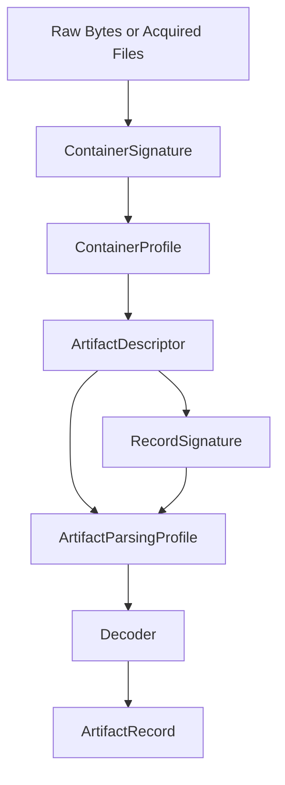

[](https://crates.io/crates/forensic-catalog)
[](https://docs.rs/forensic-catalog)
[](https://github.com/SecurityRonin/forensic-catalog/actions/workflows/ci.yml)
[](LICENSE)
[](https://www.rust-lang.org)
[](https://github.com/sponsors/h4x0r)

# forensic-catalog

**Stop hardcoding artifact paths and MITRE tags into your DFIR tool.**

150+ forensic artifacts — registry keys, files, event logs — each with a decoder, MITRE ATT&CK mapping, triage priority, and source citations. Embed it all in one line.

```toml
[dependencies]
forensic-catalog = "0.1"
```

Zero dependencies. No I/O. Everything lives in `const` memory.

---

## See it in 30 seconds

```rust
use forensic_catalog::ports::is_suspicious_port;
use forensic_catalog::catalog::{CATALOG, TriagePriority};

// Boolean port check — no allocations
assert!(is_suspicious_port(4444)); // Metasploit default

// What to look at first — sorted Critical → High → Medium → Low
let top = CATALOG
    .for_triage()
    .into_iter()
    .filter(|d| d.triage_priority == TriagePriority::Critical)
    .collect::<Vec<_>>();
```

If that looks useful, keep reading.

---

## Why use this instead of rolling your own?

Every DFIR tool eventually accumulates a hand-rolled list of artifact paths, MITRE tags, and triage rules scattered across constants, comments, and config files. That list drifts, goes uncited, and becomes a maintenance burden.

`forensic-catalog` is that list, structured:

- Each artifact has a **known location** (hive, key path, file path), a **decoder**, a **triage priority**, and **authoritative source URLs** — all in one `const`-constructible struct
- The catalog is **queryable** — by MITRE technique, triage priority, keyword, or structured filter
- **Zero deps** — no supply-chain risk, embeds in any binary including `#![no_std]`-adjacent tooling

---

## Decode a raw artifact

```rust
use forensic_catalog::catalog::CATALOG;

let d = CATALOG.by_id("userassist_exe").unwrap();
let record = CATALOG.decode(d, value_name, raw_bytes)?;

// record.fields      — Vec<(&str, ArtifactValue)>: typed field pairs
// record.timestamp   — Option<String>: ISO 8601 UTC when present
// record.mitre_techniques — carried from the descriptor
// record.uid         — stable unique ID built from key fields
```

Built-in decoders: `Rot13Name` (UserAssist), `FiletimeAt` (FILETIME → ISO 8601), `BinaryRecord` (fixed struct layout), `MruListEx`, `MultiSz`, `Utf16Le`.

---

## Query the catalog

```rust
// All artifacts relevant to a MITRE technique
let hits = CATALOG.by_mitre("T1547.001");

// Triage-ordered list — Critical first
let ordered = CATALOG.for_triage();

// Keyword search across name and meaning
let hits = CATALOG.filter_by_keyword("prefetch");

// Structured filter
use forensic_catalog::catalog::{ArtifactQuery, DataScope, HiveTarget};
let hits = CATALOG.filter(&ArtifactQuery {
    scope: Some(DataScope::User),
    hive: Some(HiveTarget::NtUser),
    ..Default::default()
});
```

---

## Indicator tables

Ten flat lookup modules — no schema, no decoder, just fast boolean checks:

```rust
use forensic_catalog::{
    ports::is_suspicious_port,
    lolbins::is_windows_lolbin,
    processes::MALWARE_PROCESS_NAMES,
    persistence::WINDOWS_RUN_KEYS,
    remote_access::is_lolrmm_path,
    third_party::identify_application,
};
```

<details>
<summary>Full module list</summary>

| Module | Covers | Key API |
|---|---|---|
| `ports` | C2, Cobalt Strike, Tor, WinRM, RAT defaults | `is_suspicious_port(u16)` |
| `lolbins` | Windows LOLBAS + Linux GTFOBins | `is_windows_lolbin(&str)`, `is_linux_lolbin(&str)` |
| `processes` | Known malware / masquerade process names | `MALWARE_PROCESS_NAMES` |
| `commands` | Reverse shells, PowerShell abuse, download cradles | pattern slices |
| `paths` | Suspicious staging and hijack paths | path slices |
| `persistence` | Run keys, cron/init, LaunchAgents, IFEO, AppInit | `WINDOWS_RUN_KEYS`, `LINUX_PERSISTENCE_PATHS`, `MACOS_PERSISTENCE_PATHS` |
| `antiforensics` | Log-wipe, timestomping, rootkit indicators | indicator slices |
| `encryption` | BitLocker, EFS, VeraCrypt, Tor, archive tools | path slices |
| `remote_access` | LOLRMM / RMM tool indicators | `all_lolrmm_paths()`, `is_lolrmm_path(&str)` |
| `third_party` | PuTTY, WinSCP, OneDrive, Chrome, Dropbox | `identify_application(&str)` |
| `pca` | Windows 11 Program Compatibility Assistant | path / key constants |
| `references` | Queryable source map per module | `module_references(name)` |

</details>

---

<details>
<summary>ArtifactDescriptor — full field reference</summary>

Every entry in `CATALOG` is a `const`-constructible `ArtifactDescriptor`:

| Field | Type | Description |
|---|---|---|
| `id` | `&'static str` | Machine-readable identifier, e.g. `"userassist_exe"` |
| `name` | `&'static str` | Human-readable display name |
| `artifact_type` | `ArtifactType` | `RegistryKey`, `RegistryValue`, `File`, `Directory`, `EventLog`, `MemoryRegion` |
| `hive` | `Option<HiveTarget>` | Registry hive, or `None` for file/memory artifacts |
| `key_path` | `&'static str` | Path relative to hive root |
| `scope` | `DataScope` | `User`, `System`, `Network`, `Mixed` |
| `os_scope` | `OsScope` | `Win10Plus`, `Linux`, `LinuxSystemd`, etc. |
| `decoder` | `Decoder` | `Identity`, `Rot13Name`, `FiletimeAt`, `BinaryRecord`, `Utf16Le`, … |
| `meaning` | `&'static str` | Forensic significance |
| `mitre_techniques` | `&'static [&'static str]` | ATT&CK technique IDs |
| `fields` | `&'static [FieldSchema]` | Decoded output field schema |
| `retention` | `Option<&'static str>` | How long the artifact typically persists |
| `triage_priority` | `TriagePriority` | `Critical` / `High` / `Medium` / `Low` |
| `related_artifacts` | `&'static [&'static str]` | Cross-correlation artifact IDs |
| `sources` | `&'static [&'static str]` | Authoritative source URLs (MITRE, SANS, vendor docs) |

</details>

---

<details>
<summary>Parsing stack and scope boundary</summary>

This crate is a **forensic catalog**, not a full parsing engine. Compact stable transforms (UserAssist ROT13, FILETIME, MRU ordering) live in-core. Large evolving parsers (hiberfil.sys, full WMI repository, BITS job store) belong in separate companion crates.

Parsing knowledge is layered:



- **`ContainerSignature`** — magic bytes, offsets, and structural invariants for recognizing or carving outer containers
- **`ContainerProfile`** — how to open and enumerate a container (Registry hive, SQLite, EVTX, OLE CFB, memory image)
- **`ArtifactDescriptor`** — where the artifact lives inside that container and why it matters
- **`ArtifactParsingProfile`** — artifact-specific semantics (UserAssist ROT13, WMI subscription triads)
- **`RecordSignature`** — carving and validation of individual records or payload fragments
- **`Decoder`** — compact in-core transforms

All layers are queryable via `CATALOG`:

```rust
let cp  = CATALOG.container_profile("windows_registry_hive");
let cs  = CATALOG.container_signature("windows_registry_hive");
let pp  = CATALOG.parsing_profile("userassist_exe");
let rs  = CATALOG.record_signatures("userassist_exe");
```

</details>

---

## Docs

| | |
|---|---|
| [DFIR Handbook](https://securityronin.github.io/forensic-catalog/forensic_catalog/handbook/) | Artifact families, investigation paths, carving guidance |
| [API Reference](https://docs.rs/forensic-catalog) | Full rustdoc |
| [Architecture Diagram](https://securityronin.github.io/forensic-catalog/architecture.html) | Data-flow: raw bytes → ArtifactRecord |
| [Module Source Map](docs/module-sources.md) | Per-module authoritative references |

---

## Used by

- [`RapidTriage`](https://github.com/SecurityRonin/RapidTriage) — live incident response triage tool
